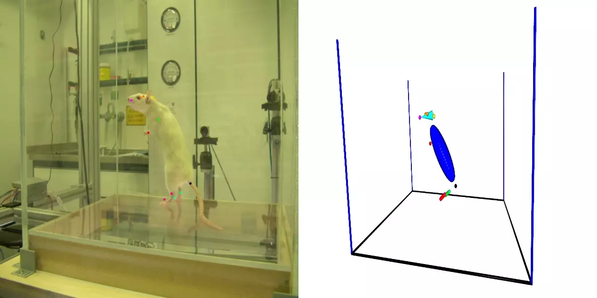
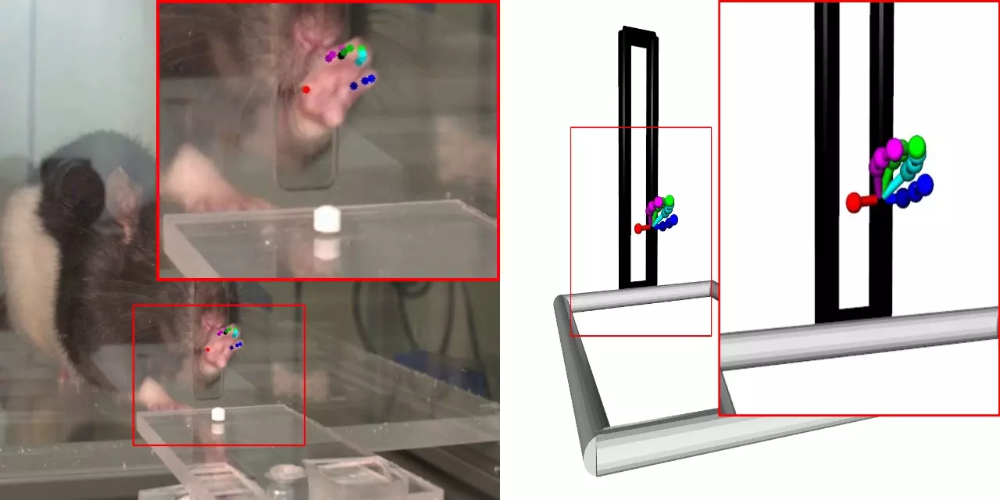

# FreiPose: A Deep Learning Framework for Precise Animal Motion Capture in 3D Spaces

**IMPORTANT**
**Paper is under review and code will be added upon paper acceptance**

We present a general purpose framework to estimate 3D locations of predefined landmarks (f.e. skeletal joints of an animal)
 given information from multiple cameras using deep learning methods.
Our frame work is configurable which makes it easy to adapt to the specific experimentation needs and general in terms of
number, type and location of cameras used as well as adaptable over a wide range of subjects of interest (animals, objects, humans, ...). 
Our goal is to bring deep learning based methods into the labs, without the need of expert knowledge about machine learning.

This is the code published in conjunction with our recent paper
    
    @TechReport{Freipose2020,
        author    = {Christian Zimmermann, Artur Schneider, Mansour Alyahyay, Ilka Diester and Thomas Brox},
        title     = {FreiPose: A Deep Learning Framework for Precise Animal Motion Capture in 3D Spaces},
        year      = {2020},
        url          = {"https://lmb.informatik.uni-freiburg.de/projects/freipose/"}
    }
     
and is free to use for academic research, when properly cited. For commercial use please contact the authors.

## Examples

## Overview

This is an easy to install Docker container using the code of the [main](https://github.com/lmb-freiburg/FreiPose) repository.
An introductory tutorial example is shown below that gives an overview of FreiPoses' workflow, for a detailed user guide please consult the main repository.

## Installation
**Paper is under review and code will be added upon paper acceptance, so installation is not possible yet.**

We use [nvidia-docker](https://github.com/NVIDIA/nvidia-docker#quick-start) for easy installation of the framework.
For installation of Docker follow the steps outlined under the given link. Afterwards you can setup FreiPose by

    git clone https://github.com/lmb-freiburg/FreiPose-docker && cd FreiPose-docker && make 
    
to build the Docker container. This process takes several minutes (>10 min). Make sure that all directories up to the `FreiPose` folder mounted have o+x rights, otherwise you will encounter errors when Docker is attempting to mount the shared directory between host and container.
    
    
## Tutorials

We provide some examples that show most features of the presented frame work. It shows how to work with the Docker 
environment, make and refine pose predictions. There are also videos you can watch along side with the steps described.
The videos are linked on the respective Tutorial site.

While not strictly necessary it is recommended to watch the Tutorial in the presented order.

Also, it is **strongly** recommended to watch the videos while or before reading the instructions presented here.
The videos contain many more explanations and make it much easier to follow the individual steps. 
The following textual tutorials are meant as a reference to the most important commands used in the videos and for 
future reference. 

[Tutorial: Overview Pose Estimation](https://github.com/lmb-freiburg/FreiPose-docker/blob/master/Tutorial_OverviewPose.md)  (~1h)

[Tutorial: Selection and Labeling](https://github.com/lmb-freiburg/FreiPose-docker/blob/master/Tutorial_SelectionLabeling.md)  (~20min)

[Tutorial: Calibration](https://github.com/lmb-freiburg/FreiPose-docker/blob/master/Tutorial_Calibration.md)  (~20min)

[Tutorial: Configuration Files](https://github.com/lmb-freiburg/FreiPose-docker/blob/master/Tutorial_Configuration.md)  (~15min)

[Tutorial: Adapt to a new Task](https://github.com/lmb-freiburg/FreiPose-docker/blob/master/Tutorial_NewTask.md)  (~1.5h)

Are you missing a topic in the existing tutorials? Let us know!

## Support
If you have problems with the code or any further questions, please feel free to contact us:

- [Artur Schneider](https://www.optophysiology.uni-freiburg.de/labmembers/artur), Optophysiology Lab, University of Freiburg
- [Christian Zimmermann](https://lmb.informatik.uni-freiburg.de/people/zimmermc/), Pattern Recognition and Image Processing, University of Freiburg
     

## Requirements

- Ubuntu 18 (or a comparable Linux operating system)
- nVIDIA GPU with at least 8GB memory
- CPU that supports AVX instructions
- GPU driver that supports at least CUDA 10.0  
