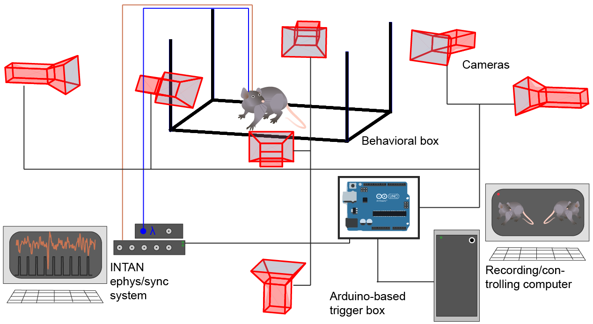

# Tutorial: Building a setup

**Goal**: Learn whats important when building a multi-camera recording setup. 

**Cameras**

1. Use cameras with hardware trigger. Errors in temporal alignment between cameras are very hard to deal with and directly deteriorate the accuracy of your system.
2. Use enough cameras. More cameras are always better. How many cameras you need for your experiment depends on:
    - The degrees of freedom your animal has. If the motion is constrained less cameras will be able to achieve the same accuracy.
    - Occlusion: In general try to place cameras so each keypoint is visible from (at least) two cameras at any time for any possible animal pose.
    So the amount of cameras needed increases as other objects are present in the recordings.
3. Use __planar__ transparent glas-like material for floor and wall sides of your experimental box. If walls or floor deviate in evenness this will deteriorate the pose estimation because of optical distortions. 
4. Mirrors can be used to bypass space limitations e.g. getting a sideview with not enough distance on the side to place a camera. However, care should be taken that the object of interest is only visible through the mirror, otherwise the calibration wont work well. Also note, in this case the extrinsic matrix will resemble the virtual camera position. 
    - It might possible to get a "free" camera by viewing the object through the mirror and directly. In this case the image need to be split in 2 to resemble a 2. camera. *This is not tested, use with caution.*
5. Make sure that each camera sees the experimental area through __maximal one__ planar side face. If it observes the animal through multiple sides it will become impossible to exactly calibrate the cameras.
6. Try to reach a high pixel resolution for the keypoints you are interested in.
7. Use fixed focal length lenses. Or at least don't change lens settings after camera calibration. Never use cameras with auto focus turned on.

 
**Mechanical Fixture**

1. Use proper camera mounts, that dont easily rotate.
2. Try to place cameras so you don't accidentally touch them when putting animals into the experiment.
3. A rigid fixture is not optional. If parts of the fixture easily move when you press with your hand camera calibration is up to chance.
4. Make sure the experiment box doesnt move with respect to the remaining fixture.
5. If possible add a uniform background to reduce background lab clutter. It will ease pose estimation. 
    (For the scope of the paper we deliberately chose to show that it still works with clutter visible, but more labeling effort is needed.)

 
**Lighting**

1. Indirect lighting is better than direct lighting.
2. Try to avoid that cameras face directly into the light source.

 
**Experimentation PC**

1. Should have at least one NVIDIA GPU with 8GB memory.
2. We used Basler USB 3.0 cameras and found it necessary to use additional PCI extension cards with sufficient USB controllers. Just having many outlets doesn't mean the card can actually transfer data fast enough.
    In our experiments the bottleneck for high FPS recordings lied on the USB transfer rates rather than software or the SSD for storing the videos.     
3. Our software currently only supports Ubuntu 18, although other operating systems might also work. To the best of our knowledge all libraries used are also available on other platforms.
4. Your computer need to support AVX instructions (Almost all CPUs do this nowadays)

**Hardware Triggering**

1. Most "industrial" grade cameras have an option to acquire frames upon a external signal. We used Basler USB 3.0 cameras which have multiple input-lines.  
2. Cameras are parametized to record frames when they sense a rising edge on the input line. We employ a low-cost arduino uno board as signal generator. However, any signal generator, which can produce a temporally-stable TTL signal in the desired fps range should work.
3. We connect same line of all cameras in parallel to a single pin of the arduino. Arduino is programmed to listen to SerialPort and react upon received signals. Signals can be: [ S*int* -start triggering at *int* fps, Q - stop triggering, P - responde if alive, T*string* - send *string* over a pin as ascii characters]. The string output can be used to sent an Id-sequenz or any other information(e.g. video file name) to a sync-system to help identify the corresponding video.
Our RecordTool implements the commutication with the trigger box.
4. Arduino code can be found under 
5. To sync the frame timings with ephys or any other signal we record the frametrigger as digital input with INTAN recording system. INTAN also records other experimental signals and ephys data.
